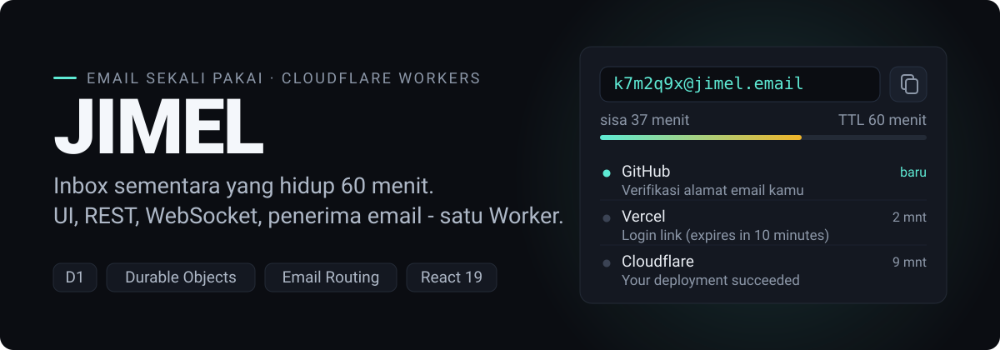
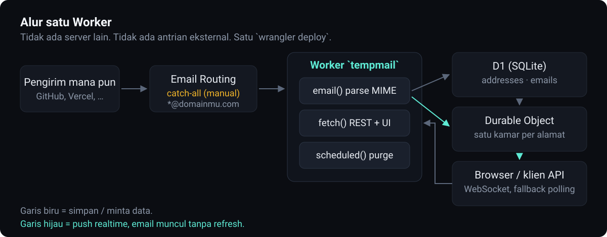

<div align="center">



<br>

[](LICENSE)
[](https://developers.cloudflare.com/workers/)
[](https://react.dev)
[](https://www.typescriptlang.org)
[](https://biomejs.dev)

**Inbox email sekali pakai di domainmu sendiri.** Satu Worker menyajikan UI, REST API, WebSocket realtime, dan penerima email sekaligus - tanpa VPS, tanpa server SMTP, tanpa biaya bulanan.

[English](README.md) · Bahasa Indonesia

</div>

---

## Deploy sekali klik (terhubung Git, auto-update)

[](https://deploy.workers.cloudflare.com/?url=https://github.com/alhifnywahid/jimel)

Ini jalur yang disarankan. Klik tombolnya, Cloudflare otomatis:

1. **Clone repo ini** ke akun GitHub-mu sendiri.
2. **Auto-provision** database D1 dan Durable Object lalu mengikatnya ke Worker - tidak ada `database_id` yang perlu diisi, Worker membuat tabelnya sendiri saat pertama jalan.
3. **Build dan deploy** Worker.
4. **Menyambungkan CI/CD** (Workers Builds): sejak itu, **tiap `git push` ke `main` auto-deploy**. Kamu tidak pernah menjalankan perintah deploy lagi.

Setelah deploy pertama, tersisa dua langkah manual (keduanya sekali saja, keduanya karena menyentuh akun dan domainmu sendiri):

**a) Atur domainmu.** Edit [`wrangler.toml`](wrangler.toml) di repo barumu, pada baris `MAIL_DOMAINS`, lalu commit - push-nya auto-deploy:

```toml
MAIL_DOMAINS = "domainkamu.com"          # atau "domain1.com,domain2.io" untuk beberapa
```

**b) Arahkan catch-all Email Routing** (per domain, kalau tidak email tidak akan masuk):

> Cloudflare Dashboard → pilih domain → **Email** → **Email Routing** → tab **Routing rules** → **Catch-all address** → Edit → Action **Send to a Worker** → pilih `tempmail` → Enabled → Save.

Buka URL aplikasi, alamat langsung dibuatkan untukmu. Kirim email ke alamat itu dari mana saja - muncul realtime, tanpa refresh.

### Menambah atau menghapus domain nanti

Tanpa CLI, tanpa login. Cukup edit `MAIL_DOMAINS` di `wrangler.toml` lalu push:

```toml
MAIL_DOMAINS = "domain1.com,domain2.io,domainbaru.net"   # tambah: sisipkan
MAIL_DOMAINS = "domain1.com"                             # hapus: buang dari daftar
```

`git push` → Cloudflare auto-deploy perubahannya. Untuk domain yang **baru ditambah**, lakukan langkah catch-all (b) sekali. Untuk domain yang **dihapus**, opsional matikan lagi catch-all-nya di dashboard. Domain pertama di daftar selalu jadi default di UI.

## Atau deploy dari komputermu (CLI)

Lebih suka menjalankan sendiri, atau tidak pakai build terhubung-Git? Satu perintah mengurus semuanya:

```bash
git clone https://github.com/alhifnywahid/jimel.git
cd jimel
npm install
npm run setup -- domainkamu.com
```

Perintah itu login ke Cloudflare, membuat database D1, menulis konfigurasi, membangun frontend, dan men-deploy Worker - lalu mencetak URL aplikasimu. Deploy ulang setelah perubahan dengan `npm run deploy`; tambah domain nanti dengan `npm run setup -- domain1.com domain2.com`. Langkah catch-all di atas tetap berlaku.

## Kenapa ini berbeda

Layanan tempmail publik punya masalah yang sama: domainnya sudah masuk daftar blokir di mana-mana, isi inbox bisa dibaca siapa pun yang menebak alamatnya, dan API-nya bisa mati atau berbayar kapan saja.

JIMEL memindahkan seluruhnya ke akun Cloudflare-mu:

|           | Tempmail publik                  | JIMEL                            |
| --------- | -------------------------------- | -------------------------------- |
| Domain    | dipakai bersama, sering diblokir | domainmu, reputasi bersih        |
| Biaya     | gratis sampai tiba-tiba tidak    | gratis di Workers free tier      |
| API       | bisa berubah / dibatasi          | milikmu, tanpa rate limit        |
| Realtime  | polling                          | WebSocket push                   |
| Umur data | tak jelas                        | TTL yang kamu atur, dihapus cron |

## Cara kerjanya



Satu Worker, tiga pintu masuk:

- **`email()`** - Email Routing meneruskan seluruh email catch-all ke sini. Worker parse MIME ([postal-mime](https://github.com/postalsys/postal-mime)), simpan ke D1, lalu ping Durable Object milik alamat itu. Email ke alamat yang belum pernah diklaim dibuang diam-diam supaya spam acak tidak menumpuk.
- **`fetch()`** - Hono melayani `/api/*` dan `/ws/*`; sisanya jatuh ke SPA React lewat Static Assets. Frontend dan backend satu URL, jadi tidak ada CORS yang perlu diurus di UI.
- **`scheduled()`** - cron tiap 10 menit menghapus alamat dan email yang lewat TTL.

Realtime-nya pakai **Durable Object dengan WebSocket Hibernation**: satu objek per alamat email, dan koneksi yang idle tidak menagih durasi. Kalau WebSocket gagal (proxy korporat, jaringan aneh), frontend otomatis turun ke polling REST tiap 8 detik - inbox tetap terisi.

## Fitur

- **Multi-domain** - satu deploy melayani beberapa domain, pengguna memilih dari dropdown
- **Alamat kustom** - ketik prefix sendiri, atau biarkan diacak
- **Realtime** - WebSocket push, fallback polling otomatis
- **TTL** - email dan alamat kadaluarsa sendiri, dibersihkan cron
- **Halaman dokumentasi bawaan** - buka `/docs` di aplikasi yang sudah deploy; lengkap dengan contoh `curl`, contoh respons, dan prompt siap-tempel untuk AI
- **API tanpa autentikasi** - sengaja, supaya script lama cukup ganti base URL ([lihat catatan keamanan](#keamanan-dan-batasan))
- **Tema** - dark/light, beberapa preset warna, layout sidebar bisa diatur

## API

Base URL = URL Worker-mu. Semua respons dibungkus envelope `{ success, data }` atau `{ success, error }`. Waktu memakai **epoch detik**.

| Metode   | Endpoint                | Fungsi                                                               |
| -------- | ----------------------- | -------------------------------------------------------------------- |
| `GET`    | `/api/domains`          | daftar domain aktif; yang pertama = default                          |
| `POST`   | `/api/address/generate` | klaim alamat, atau buka kalau sudah ada - body `{ prefix, domain?, exclusive? }` |
| `GET`    | `/api/inbox/{address}`  | daftar header email; `404` kalau alamat belum diklaim                |
| `GET`    | `/api/email/{id}`       | isi penuh email, sekaligus menandai sudah dibaca                     |
| `DELETE` | `/api/email/{id}`       | hapus satu email (idempotent)                                        |
| `WS`     | `/ws/{address}`         | push realtime: `ready`, `email`, `pong`                              |

```bash
# klaim alamat lalu baca inbox-nya
curl -X POST https://tempmail.contoh.workers.dev/api/address/generate \
  -H 'Content-Type: application/json' \
  -d '{"prefix":"halo123"}'

curl https://tempmail.contoh.workers.dev/api/inbox/halo123@domainkamu.com
```

Referensi lengkap ada di halaman `/docs` aplikasimu - termasuk prompt yang bisa kamu tempel ke AI supaya langsung paham cara integrasinya.

## Konfigurasi

**Tidak ada `.env`.** Worker tidak membaca file `.env` saat runtime; konfigurasi masuk sebagai binding dari [`wrangler.toml`](wrangler.toml) waktu deploy.

```toml
[vars]
MAIL_DOMAINS = "domainkamu.com,domainlain.io"   # comma-separated; yang pertama = default
MESSAGE_TTL_MINUTES = "60"                       # umur email & alamat
```

`npm run setup -- domain1.com domain2.com` menulis dua baris itu dan `database_id` untukmu. Domain juga bisa kamu edit tangan lalu jalankan `npm run setup` tanpa argumen. Setelah menambah domain, ulangi langkah catch-all di dashboard untuk domain baru itu.

Belum ada secret apa pun di project ini. Kalau nanti kamu menambahkan (misal webhook), pakai `wrangler secret put NAMA` - jangan taruh di `wrangler.toml`.

## Development

```bash
npm install
npm run db:init:local     # buat tabel di D1 lokal
npm run dev               # Worker + API di http://127.0.0.1:8787
npm run dev:web           # UI dengan HMR di http://localhost:5173 (proxy ke 8787)
```

`npm run dev` saja sudah cukup untuk menguji API. Tambahkan `dev:web` di terminal kedua kalau sedang menggarap UI.

Perintah lain:

| Perintah                      | Fungsi                                   |
| ----------------------------- | ---------------------------------------- |
| `npm run setup -- domain.com` | setup + deploy sekali jalan (idempotent) |
| `npm run deploy`              | deploy ulang setelah ubah kode           |
| `npm run typecheck`           | TypeScript semua workspace               |
| `npm run lint` / `lint:fix`   | Biome                                    |

Menguji `email()` lokal tanpa domain: `npx wrangler dev` lalu POST file `.eml` ke endpoint email lokal wrangler. Pastikan `.eml`-mu punya header `Message-ID` dan `Date`, kalau tidak parser menolaknya.

## Struktur

Monorepo npm workspaces, satu `node_modules` dan satu lockfile di root.

```
.
├── apps/
│   ├── api/                    Worker - Hono, D1, Durable Object, handler email
│   │   ├── src/
│   │   │   ├── index.ts        router + email() + scheduled()
│   │   │   ├── inbox-room.ts   Durable Object, WebSocket Hibernation
│   │   │   ├── lib.ts          util murni (domain, prefix, waktu)
│   │   │   └── types.ts        tipe infrastruktur (Env, row D1)
│   │   └── schema.sql
│   └── web/                    Frontend - Vite, React 19, Tailwind v4, shadcn/ui
│       └── src/
│           ├── features/mail/  inbox, alamat, sinkronisasi realtime
│           └── features/docs/  halaman dokumentasi API
├── packages/
│   └── shared/                 kontrak API yang dipakai kedua sisi (DTO, tipe pesan WS)
├── scripts/
│   └── setup-deploy.mjs
└── wrangler.toml               config Worker - di root supaya Workers Builds menemukannya
```

Batas modulnya sengaja dijaga: `packages/shared` hanya berisi DTO yang menyeberangi jaringan, tipe infrastruktur D1 tinggal di `apps/api`, dan frontend punya view-model sendiri yang dipetakan dari DTO - jadi mengubah bentuk row database tidak merembet ke komponen React.

## Keamanan dan batasan

**API-nya publik dan tanpa autentikasi. Ini keputusan desain, bukan kelalaian.** Konsekuensinya:

- Siapa pun yang tahu sebuah alamat bisa membaca inbox-nya lewat API, dan klaim alamat bersifat idempotent - pemanggil kedua membuka inbox yang sama, bukan ditolak. Itulah yang membuat satu inbox bisa dipakai dari beberapa perangkat; artinya juga sebuah alamat hanya seprivat kenyataan bahwa belum ada yang menebaknya. Perlakukan setiap alamat sebagai rahasia jangka pendek.
- Siapa pun bisa mengklaim alamat di domainmu. Kalau instansmu dipakai publik, pertimbangkan Cloudflare WAF rate limiting di `/api/address/generate`.
- Jangan pakai untuk apa pun yang penting: reset password akun asli, dokumen, data pribadi.
- Email disimpan sebagai plaintext di D1-mu sampai TTL habis.

Kalau butuh instans privat, cara termudah adalah menaruh Cloudflare Access di depan Worker.

Menemukan celah? Baca [SECURITY.md](SECURITY.md) - jangan buka issue publik.

## Kontribusi

Isu dan PR diterima. Baca [CONTRIBUTING.md](CONTRIBUTING.md) untuk alur kerja dan gaya kode, serta [CODE_OF_CONDUCT.md](CODE_OF_CONDUCT.md). Butuh bantuan pemakaian, bukan melaporkan bug? [SUPPORT.md](SUPPORT.md).

## Lisensi

Open source di bawah [MIT](LICENSE). Ringkasnya: bebas dipakai, dimodifikasi, dan di-deploy ulang - termasuk untuk keperluan komersial - selama notis copyright-nya tetap disertakan. Tidak ada garansi; instans yang kamu deploy adalah tanggung jawabmu.

<div align="center">

<br>

Email sekali pakai · Pakai untuk mendaftar layanan, uji coba, dan pengujian - bukan untuk menyalahgunakan layanan orang lain atau menerima apa pun yang penting.

**JIMEL** · Copyright (c) 2026 Alhifny Wahid · Dirilis di bawah Lisensi MIT.

</div>
